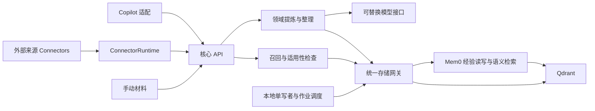

# 架构与 Mem0 边界

日期：2026-09-14。本文保留 Mem0 OSS + Qdrant 原型的存储与恢复设计，技术依据见[核验记录](research/2026-09-12/README.md)。目标记忆层按[重新选型与接入抽象](research/2026-09-14-memory-selection/README.md)推进 Hindsight 适配；正式发布与进程部署按[安装设计](10-distribution-and-installation.md)，两者均待实现。

部分路径已有 [P0 运行结果](research/2026-09-13-p0/README.md)。Mem0 3.1.8、Qdrant client 1.18.0 / server 1.19.1 配合本地嵌入，通过了隔离存储检查。Mem0 发布包会在顶层导入未使用的 SQL provider，因此无 SQL 依赖时，仅设置 disableHistory 仍无法 import，需要加载适配。该原型存储只使用 Qdrant；保留 Mem0 适配时仍须解决模块加载并固定兼容版本，不将这些限制套到 Hindsight。

## 现有原型选择

采用 TypeScript 本地服务，Mem0 管理经验，Qdrant 是唯一数据库。当前经验、向量、字段索引和必要的运行状态都留在 Qdrant。没有 SQLite、独立全文数据库或第二份当前经验。

Mem0 是当前经验的写入入口。领域层提炼结构化经验，逐条调用 `add(..., { infer: false, metadata })`。这条初次写入路径不执行默认提取、去重或实体抽取；它们不能算作已复用能力。后续 update 仍可能调用内部实体关联，纳入成本测试。

Qdrant 的字段查询、分页和少量管理记录由同一 Gateway 封装，补足 Mem0 公共 API 未暴露的能力。扩展和业务模块不直接访问数据库，经验正文的正常写入仍走 Mem0。

## 交付与运行形式

正式产品通过固定版本 `irm` bootstrap 下载预构建组件并安装到当前用户目录。核心独立运行在本地后台，每个用户数据目录只允许一个管理实例。CLI 管理初始化、启动、停止、状态和修复，Copilot 会话或安装终端结束不会停止已接收的学习作业。首期提供带版本号的 HTTP API，只监听 loopback，并用本地凭据认证。

默认 Hindsight 发行配置由后台管理进程启动私有 Python/Hindsight、PostgreSQL 与本地模型组件；核心仍提供统一 API。部署不要求用户手工安装 Docker、数据库或开发工具链。数据库进程与数据路径、隐藏窗口、所有权核验、分项健康和升级顺序以[发布与安装](10-distribution-and-installation.md)为准。此部署方案须先通过干净 Windows 的发行切片，不能由 Mem0 P0 通过结果替代。

| 交付单元 | 形式 | 边界 |
|---|---|---|
| 安装与组件清单 | 固定 tag 的 PowerShell bootstrap、平台 zip 与摘要 | 预构建私有运行依赖、用户 PATH/稳定 launcher、版本切换和恢复；不现场从源码安装依赖 |
| 核心实现 | TypeScript 模块，由后台服务加载 | 经验提炼、生命周期、检索、单写者和存储网关 |
| 后台服务与 CLI | 当前用户本地程序，私有 runtime | 管理实际后端组件；关闭终端继续运行；可选登录自启，不使用机器级服务 |
| 本地 Web UI | 随核心安装包提供的浏览器界面 | 核心服务提供静态资源及同源 API；搜索、管理和配置均调用核心，不直连数据库 |
| 客户端 SDK | 薄 TypeScript API 客户端 | 类型、认证、序列化和错误处理；不加载 Mem0、不直接连 Qdrant |
| MCP bridge | stdio 工具进程 | 把代理工具请求转给同一服务；不保存经验或启动独立写者 |
| Copilot 扩展 | GitHub Copilot CLI plugin | 插件清单、hooks、MCP 配置与必要 skills，使用 SDK/bridge 接入 |
| Connector 接入 | 通用运行模块与注册来源模块 | 定时/认证提交、增量同步、来源更新与连接管理 |

核心可以按库组织代码和测试，但首期不把嵌入式引擎 SDK 作为第二种部署方式。安装多个代理插件或关闭某个插件，不会创建或销毁核心经验库。可选 Copilot SDK 模型提供商由服务在通用 ExtractionModel 接口后加载，与 Copilot plugin 分开。

CLI 可以打开本地 UI，关闭页面不停止服务。浏览器会话须认证，修改操作沿用核心的权限和来源校验；监听 loopback 不能代替认证。前端只缓存展示状态，不持久保存经验副本。首期不另设 UI 后端、桌面壳或云服务。安装与更新分别报告程序、服务、模型和代理接入状态；缺 Copilot 登录不启动自动学习，不要求额外模型 API key。

下文存储、索引和故障恢复继续描述现有 Mem0/Qdrant 原型。实现 Hindsight 时，产品规则保持，物理存储和 operation 合同须按实际适配器重新设计、测试；不能用原型的 Qdrant 单数据库约定限制发行依赖。

## 能力分工

| 能力 | 负责组件 | 实现边界 |
|---|---|---|
| 经验读写与语义召回 | Mem0 | 保存结构化 metadata，基于 memory 文本生成嵌入和候选 |
| 范围、状态、时间、层次、主题筛选 | Qdrant payload 索引 | 网关规范化过滤，候选返回前复核 |
| 精确实体与指定字段查询 | Qdrant 原生过滤 | keyword 精确值与 text 分词语义分别声明，不等同于通用相关性排序 |
| 来源与依赖查找 | Qdrant 字段查询 + 应用 | payload 保存来源指纹和依赖 ID，应用验证修订与适用性 |
| 浏览与完整导出 | 网关封装 Qdrant scroll | Mem0 getAll 未暴露完整游标；一致导出须确认写入已结束 |
| 学习任务与恢复 | 应用单写者 + Qdrant 管理记录 | 有限调度与未知结果隔离，不承诺跨 collection 事务 |
| 纠错与来源删除 | 应用策略 + Mem0/Qdrant | 当前修订、必要删除记录和来源清理，不提供首版历史回滚 |

多层提炼、反例判断和经验整理由领域层实现，存储框架不负责判定这些结论是否成立。

## 存储与组件边界

Qdrant 中只有两类应用数据：Mem0 管理的经验 collection，以及一个有限的 `lessonloop_operations` 管理 collection。后者按 recordType 保存集合配置、短期学习作业、未确认操作、来源控制记录、连接配置/游标、源对象绑定和代理 checkpoint，不复制一份完整当前经验。完整对象、保留期及容量见[存储数据模型](07-storage-model.md)。Mem0 可能创建实体辅助 collection；仍由 Mem0 管理并使用相同 Qdrant 后端。

管理记录不做语义嵌入、不进入经验召回；P0 验证使用只含 payload 的 points。普通作业完成后清理材料，未确认操作保留到修复。领取、顺序、预算与退避由单进程单写者负责；Qdrant 不是事务队列，不承诺多实例抢占或跨 collection 原子提交。

| 组件 | 职责 |
|---|---|
| CoreService | 本地认证、范围、经验操作、单写者协调 |
| LearningService | 持续意图与价值准入、L1–L5、证据判定、条件/例外、来源绑定与有限复评 |
| MemoryGateway | Mem0 读写/语义检索，内部 Qdrant 字段查询/scroll/管理记录 |
| RetrievalService | 任务理解、查询模式选择、当前状态和适用性检查 |
| JobRunner | 有限作业调度、预算、确定失败重试、未知结果隔离 |
| ConnectorRuntime | 同步计划、分页接收、游标、重试/背压、源对象修订；不执行领域提炼 |
| Connectors / AgentAdapters | 外部来源协议或代理采集/消费与身份映射，不直接写数据库 |

核心先作为一个 TypeScript 本地服务实现，统一接口类型并接入 Mem0、Qdrant 与 Copilot SDK。Copilot 内容采集与提取模型 SDK 是独立角色。ConnectorRuntime 提供通用定时和同步管理，Connector 实现来源认证、读取与转换；LearningCore 不含邮箱或特定知识库协议。游标与源绑定通过同一网关保存，认证凭据使用系统凭据设施。

固定研究基线：`mem0ai 3.1.8`，源码 `c7ee362aff94a369af70f13f2b4f853f6793ff4c`。实施时固定实际包、Qdrant client/server 和模型版本。必须显式配置 Qdrant provider 并设置 `disableHistory: true`；否则默认 history 可能使用 SQLite。关闭路径已静态核实，但启动、读写、更新、删除和重启后均没有 SQLite 数据文件，仍须实际验证。

## 经验字段与索引

Mem0 ID 直接作为经验 ID；`user_id` 使用稳定用户身份，不默认以 `agent_id=copilot` 隔离共享经验。`ll_record` 保存除 ID/revision 外的结构字段；服务由 Mem0 外层 ID 与 `ll_revision` 组装对象。`ll_schema` 只标记格式版本。

每次拟写的唯一 `ll_write_nonce` 在调用 Mem0 前同时写入管理记录和待写 metadata，用原生精确过滤定位未知 add 的结果。它仅标识一次写操作，不参与领域修订或材料事件模型；查无结果不能证明旧请求已失败。

Mem0 memory 保存带标签的正向检索文本：结论主张、conditions.text、主题和实体。例外留在 metadata 独立字段。向量由 memory 生成，不能误以为 metadata 自动进入语义检索。

同一经验 payload 中维护少量机械投影字段：scope、state、applicability、basis、assessment、level、purpose、topics、entities、数值时间、sourceFingerprints 和依赖经验 ID。按查询建立 Qdrant keyword、数值或 text 索引，不建立 SQLite 镜像。过滤字段与结构须通过 round-trip 校验。

scopeId 只控制知识归属与访问，applicability/conditions/exceptions 定义适用范围。repo、branch 等上下文在有限候选中判断，首版不为任意 key 建索引。采集位置不自动成为适用限制，也不能按当前 repo 过滤掉未限定 repo 的通用经验。

精确标识符保留大小写和完整值。Qdrant keyword 匹配完整字符串，不等于任意子串或自然语言同义词。需要在条件中精确查询的代码/参数名，须明确提取到标识符字段；仅藏在正文里的任意词不享有精确召回保证。Qdrant text 索引可用于指定字段的词项过滤，但分词、中文与短语行为须单独验证；不能把过滤说成已验证的 BM25 排序。

结论、条件、主题和实体改变时，网关重新构建 memory，并同次 update 文本与 metadata；例外等字段更新也产生新领域 revision。非文本更新可能仍重新嵌入，接受并记录该版本成本。每次修改后读回核验；文本、metadata 和字段索引均以同一 Qdrant 记录为依据。

## 查询路径

1. 根据可信调用身份确定授权 scope，和请求集合求交；未知范围不回退全库。
2. 默认自然语言查询调用 Mem0 semantic search，预先传范围、状态、时间及显式筛选，不能在全局 top-k 后才补做。
3. 显式精确实体/标识符、来源、依赖或字段查询由网关调用 Qdrant 原生过滤；它独立于语义 top-k，能够找到未进入语义候选的精确值。不默认开发跨库 rank fusion。
4. 读取 Mem0 当前记录，复核授权、revision、active 与合法 purpose/basis/assessment、有效期、写屏障、来源和依赖；持久 applicability=unknown 不进入自动返回。先判目标相关，再检查全部条件/例外：明确不满足优先排除，仅当次缺可核实信息才 undetermined，条件齐备为 applicable。
5. applicable 返回 usage=guidance；undetermined 仅对 includeLeads=true 且理解协议的客户端返回 usage=lead，并含相关原因和 missingChecks。总共最多 3 项、约 800 token，线索最多 1 项，优先放可采用经验；完整条件/例外和用途标签不可截断。evidence 默认不返回。

显式字段/精确查询与自然语义查询由同一接口接受，但首期分别声明模式与排序语义。若后续需要稠密/稀疏联合排序，优先验证同一 Qdrant 的原生能力；这不是引入另一数据库的理由，也不是已完成能力。

指定 exceptions 的字段查询使用 browse 的显式调查入口，返回“排除条件匹配”，不能自动包装成 guidance 或 lead；recall 不接受该字段。自动召回仍检查例外，已确认命中时排除；仅缺少排除例外所需的当前信息，才可在合格候选中形成具体线索。

空查询使用 Qdrant scroll 浏览，不产生嵌入。cursor 包含后端 offset 与绑定的授权/筛选摘要，逐页仍校验权限。并发更新下不承诺快照分页；完整导出在维护窗口停止相关新写入并确认已发写全部结束后进行。Mem0 getAll 的有限返回不能冒充完整导出。

所有内容出口共用权限与来源控制检查。user_forget/erase 阻止读取正文，superseded/withdrawn 阻止自动建议但可在授权详情中说明失效来源；确认撤销访问时暂停该连接来源的自动使用。inspect 仅返回当前经验；历史引用的修订原文未保留时明确说明，不以当前文本冒充。browse 可按请求查看 held/disabled；自动 recall 的 guidance 和 lead 均只来自资格有效的 active，不因 includeLeads 放宽来源和证据门槛。

依赖最多展开 32 条、深度 5，引用父修订须仍为当前且可用。失效、循环或超过预算不返回派生建议；反向索引仅调度后台重评。Qdrant 数值有效期过滤须在限额前生效，最终再复核，不依赖 Mem0 的候选后 expiry 过滤。

Qdrant 或管理记录不可读时不返回经验；嵌入服务失败时显式精确/字段查询仍可运行，语义查询报告不可用。各查询模式分别报告自身可用性。

启动时若已有经验数据但管理 collection 缺失，进入维护状态，不能创建空管理集合后把未知写入与删除记录当作不存在。全新空库可以正常初始化；管理内容丢失则按恢复限制处理。

## 自动召回调度

AgentAdapter 负责新用户任务开始时自动调用 recall，在首次规划/行动前回填；采用相关经验前定向刷新，关键上下文/目标变化时合并补充请求，MCP 主动调用作为补充。具体边界与降级以[触发表](04-contracts-and-extensions.md)为准，不在每次工具调用上全库搜索。

任务/上下文关联、相同输入去重与在途响应序号使用消费端短期状态；取消、超时或被新请求替代的响应一律丢弃。首次请求超时不阻塞原任务，不把未返回/迟到结果当作已使用。宿主没有必要 hook 或回填能力时明确标为受限，不能以工具注册成功通过验收。

## 当次核实与状态刷新

当次 taskApplicability、missingChecks、检查次数和当前上下文只存在请求/消费端任务缓存，不新增 Qdrant 记录。定向 recall 读取 target.id、先校验访问再核对 target.revision，不使用搜索 top-k 代替精确核验；拒绝使用旧问题验证新版本。通用检索仍保留有界补取，未满额不扩大权限。

客户端按任务+经验 ID 记录最多两轮检查；改排序、修订变化、重新 recall 不自动重置同任务的检查预算。重启丢失预算时保守停止该旧线索的自动检查，新的真实用户任务可建立新预算。无新信息、权限不足和工具错误只影响本次使用，不改持久 state。

支持 lead 的适配器先检查后采用，并在依赖该经验开始一个新动作前定向刷新；同次动作所需的上下文变化也使结果失效。核心的线性化点仍是响应组装，不能承诺收回已投递内容或控制宿主所有后续行为。服务不可用时不得从客户端缓存重新取得指导资格。

## 准入执行与复评

LearningService 按[准入规则](02-experience-model.md)作出 reject/merge/retain_active/retain_held，服务独立校验来源角色、scope 权限、字段、允许状态和期限。不合格 proposal 只在 LearningJob 留短期原因，不能默认写成 held。

reviewBy 的到期扫描和新证据触发的复评使用现有 JobRunner，不新增晋级引擎。到期处理携带目标 revision，和补证/用户操作串行核对；不能用旧任务停用新版本。review 与 evidence 变化也沿用 Mem0 当前记录更新路径。

核心仅检查已有材料。review.question 与线索 missingChecks.question 都是待核实问题，不是命令；新读取或测试须在宿主已有授权内执行。当次上下文结果走 recall 重评，主张补证才经 verificationFor 关联并重新准入。不存在从记忆内容自动取得执行权限的路径。

## 作业、修改与删除

submitMaterial 只有在 Qdrant 作业写入被确认后才返回已接收。控制写本身结果未知时不继续修改经验，按已知操作 ID 核对。管理记录不是另一个经验版本系统，已完成任务不长期保留输入。

修改顺序为：同一应用写协调中读取当前经验、比较 expectedRevision，确认管理记录已持久化，再调用 Mem0 修改，读回当前内容，最后完成操作记录。旧操作结果未知时按 nonce 或经验 ID 阻止投递与后续写入。读出口在最终组装时检查该状态；已交给代理的内容不能收回。

公共 Mem0 add 在内部生成 ID，update 没有应用级 CAS。只有确定尚未发出持久写请求的失败可直接重试；Promise 报错、超时或一次查无结果都不证明没写。不能用 Promise.race 超时后释放协调并提交下一版。

管理 CLI 列出受阻操作，隔离旧写者并确认已发请求结束，按 nonce/ID 核对后恢复或继续隔离。已完成写只结束管理记录，不重新 add；仍未知不盲重放。Qdrant 不提供这里所需的跨点/跨 collection 应用事务，不声称 exactly-once。

来源控制记录区分 source_superseded、source_withdrawn、source_erased 与 user_forget，行为以[Connector 合同](08-connectors.md)为准，不把普通更新当永久删除。来源删除先确认 scope+fingerprint 控制记录持久化；所有读取、排队提取和待写 proposal 检查它。字段索引加速定位，权威 scroll 完整清点当前经验、派生副本和短期作业；清理未确认之前不报告删除完成。

删除记录在有关任务可能重放、或产品管理备份仍可能含该材料时保留。首期不支持任意旧快照自动恢复：恢复须保留并重新应用现有删除记录，无法获得完整记录时进入维护与重新导入流程。把旧内容与旧删除记录一起回滚不能保证后来删除仍有效。

## 纠正处理的结果投影

revise/feedback 返回 jobId 与 receipt，getJob 生成相同结果投影。接收由作业持久化确认；暂停由明确目标的屏障或当前非投递状态确认；生效须同修订文本、向量和 metadata 写入完成并读回一致、索引字段可读、相关屏障解除且自动资格/有效时间通过；不是“任何查询必定命中”的保证。receipt 不建立新的 Experience 状态，也不是独立通知账本。

服务只在现有短期作业中保存明确纠正目标、已完成的暂停事实与结果 id/revision 等最小数据；待写操作确认后先登记作业结果再清理操作。读取 receipt 时在现有协调边界重验当前资格，历史 completed 不作为当前有效性的凭据。普通后台学习仍只更新工作状态，针对用户明确纠正的回执由前端跟踪显示。

## P0 闸门

实际运行须验证：无 SQLite 文件；逐条结构写入；metadata 过滤在 top-k 前执行；Qdrant 精确/字段查询；完整 scroll；无嵌入管理记录的持久化；控制写先确认；迟到写隔离；删除与重启。索引构建和恢复均在同一 Qdrant 内验证。

这些是既定方案的可行性测试。失败时先提交最小复现，优先补窄网关能力或收窄首版承诺，遵守 Qdrant 单一数据库的约束。
