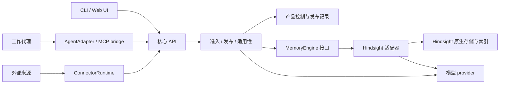

# 系统架构

日期：2026-09-14。状态：目标架构，尚待实现。Mem0/Qdrant 原型代码已删除，仅保留[历史设计](research/2026-09-13-p0/mem0-architecture.md)。当前代码包括通用评测工具和 Copilot 探针；Hindsight 能力依据及适配草案见[选型研究](research/2026-09-14-memory-selection/README.md)。

## 组件与调用方向

LessonLoop 提供一个本地核心 API。CLI、Web UI、代理和 Connector 共用它；记忆引擎、推理模型与工作代理分别适配。产品核心判断什么值得发布、谁能访问、何时适用，引擎负责原生提取、归纳和检索。

首版只实现 Hindsight 适配，对照实验使用独立实例。MemoryEngine 保留替换边界，不为已放弃的后端维护适配代码。默认发行配置由后台管理进程启动核心、Hindsight、私有 PostgreSQL 和本地模型组件，具体进程、安装及认证见[发布与本地运行](10-distribution-and-installation.md)。

| 组件 | 职责与边界 |
|---|---|
| CoreService | 本地认证、授权集合、统一操作和写协调；只监听 loopback，仍须认证 |
| LearningService | 价值与证据判断、条件/例外、发布和有限复评；可使用引擎原生提取/归纳，不重复运行一套相同流程 |
| RetrievalService | 查询方式、候选相关性、当前资格和适用性；候选分数不能授予指导资格 |
| ProductStore | 稳定经验、来源控制、引擎绑定、短期作业和恢复状态；不镜像全部引擎内部记录 |
| MemoryEngine | 厂商操作、候选、来源映射、异步阶段和能力声明；SDK、bank、collection 和分数不泄漏到产品 API |
| JobRunner | 预算、调度、重试、未知操作隔离与复评；首期每数据目录单一写协调者 |
| AgentAdapter / MCP bridge | 可信材料捕获、自动召回、核实与采用前刷新；通过核心 API 访问经验 |
| ConnectorRuntime | 来源同步、接收确认、游标和背压；各 Connector 实现具体来源协议 |
| 模型 provider | 复用同用户 Copilot 登录进行推理；与工作代理插件隔离，避免把内部学习调用再次采集 |

产品控制与引擎可共用一个 PostgreSQL 实例的独立 schema；具体映射须在适配器中验证。不能修改厂商内部表，也不能假定一次产品调用与外部引擎 API 共享数据库事务。

## 产品身份与引擎产物

用户管理的是稳定 Experience ID 和 revision。引擎可能重处理来源、拆分事实、重算归纳或改变内部 ID；这些变化不能丢失用户的停用、纠正和永久忘记意图。

对外发布的经验保留规范化内容与可核对的引擎绑定：引擎实例、处理配置、原生产物标识及版本或摘要、来源关系。引擎变化后，受影响记录先暂停使用，核对依据后重新准入。无法确定新产物该继承哪些用户控制时，保持暂停。持久字段与待实现映射见[存储数据模型](07-storage-model.md)。

Hindsight 适配器优先复用其原生提取与归纳，并声明可用的操作和证据范围。以后需要替换时，新适配器仍须通过同一产品行为合同。只返回无来源生成文本的适配器不能满足发布合同。

## 从材料到经验

1. 核心确认材料的授权、来源、大小和脱敏，可靠保存作业后才报告接收。输入无需完整会话、仓库或宿主事件 ID。
2. 适配器按所选管线提交材料或草稿，返回可查询的 operation 和实际处理阶段。接收、持久化、可查询、归纳完成分别表示，超时记为结果未知。
3. LearningService 核对候选的用途、来源、条件和例外，执行[准入规则](02-experience-model.md)。无价值可零输出；证据不足不能靠模型自报 supported 发布。
4. 核心确认发布内容、依据和引擎绑定一致，再登记结果 ID/revision。需要跨案例整理时，在限定主题与预算内继续处理，不为了产生高层标签补造支持。

学习作业完成不一定产生新经验，也不一定使某条纠正生效。API 的 receipt 按当前发布资格生成，具体合同见[接口与扩展](04-contracts-and-extensions.md#纠正回执与展示时机)。

## 从召回到采用

查询先确定授权集合，再用引擎支持的语义、精确标识符或字段方式取得候选。适配器须说明过滤位置和能力，不能在候选不足时扩大授权范围。精确标识符查询不能仅依赖语义 top-k。

候选返回前，核心读取当前发布记录，检查授权、修订、准入、有效期、来源、依赖和未确认写屏障，再判断相关性与适用条件。条件明确不符时排除，只缺本次可核实信息时才可能返回 lead。browse 的例外查询用于调查，不转成自动建议。

AgentAdapter 在新任务开始时召回，依据经验开展新动作前定向刷新；上下文或任务目标变化时废弃旧判定。响应迟到、取消或被新请求替代时丢弃。核实不自动改变经验主张，全部请求/响应字段、预算与降级规则集中在[召回协议](04-contracts-and-extensions.md#查询与结果)。

依赖检查最多展开 32 条、深度 5；父修订失效、循环或超预算时不返回派生建议，后台再复评。引擎没有可靠变更通知时，使用定向核对或对账确认绑定；核对失败不能继续使用缓存取得指导资格。服务只能保证响应组装时的当前性，已进入代理上下文的文本无法收回。

## 修改、恢复与删除

修改通过同一产品写协调核对 expectedRevision，先记录操作与必要屏障，再交给引擎，确认结果后更新发布记录和作业。已发写请求超时或一次查无结果不能证明失败，旧结果未知时隔离对应修改。适配器提供 operation、幂等键或精确查证方法，不支持的保证明确列为缺项。

重启时先核对未完成操作、当前来源修订和已有用户控制。产品控制状态丢失而引擎仍有数据时进入维护状态，不能新建空控制表后把旧内容全部发布。各后端自己的事务能力只覆盖其实际边界。

停用、来源替代、撤回和永久擦除按不同动作处理。清理先阻断使用，再清点发布记录、引擎原文/分块、基础事实、派生结果、索引或缓存，以及短期作业副本。多来源支持仍需按剩余证据重评，不能只删基础记录就报告所有派生建议已清理。具体保留与副本范围见[存储合同](07-storage-model.md)，来源状态见[Connector 合同](08-connectors.md)。

完整导出或迁移需要一致视图：停止相关新写、确认已发操作结束，或使用实际验证过的快照机制。包含未确认写入时不发布“完整”导出。回滚保留后来发生的删除和纠正；更新、备份和卸载按[发布方案](10-distribution-and-installation.md)执行。

## 当前实现与下一步

通用适用性和任务判定器保存在 [evals](../evals/README.md)，宿主验证位于 [probes/copilot](../probes/copilot/README.md)。正式 ProductStore、MemoryEngine、Hindsight 适配和真实自动学习流程还未实现，文中的组件名是设计边界。

下一步先做 Hindsight 在默认 Windows 配置下的可行性切片，同时验证通用引擎合同、来源映射与恢复。随后接通学习到使用的场景，对无额外记忆、基础引擎和完整产品做任务对照。[实施与验收](05-delivery-and-validation.md)维护阶段与门槛，[质量评估](09-quality-evaluation.md)维护测量方法。
