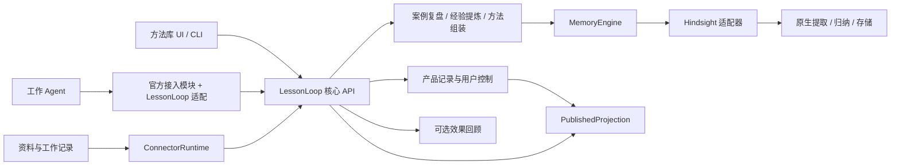

# 系统架构

日期：2026-09-15。状态：当前目标架构，核心及适配已有实现，进度见[13](13-implementation-plan.md)。官方工具是实现起点，LessonLoop 核心负责方法产品的流程和状态。

## 组件与调用方向

首期一个核心进程承载案例、学习、方法、查询和回顾模块。Hindsight 与数据库独立运行，由同一个后台管理器管理。模块名表示职责，不意味着分别部署微服务。

| 模块 | 责任 |
|---|---|
| CoreService / ProductStore | 认证、范围、类型化对象、版本、用户控制和写协调 |
| CaseBuilder | 组装 WorkView，关联动作与结果，识别共同来源和缺口 |
| LearningService | 选择主题和案例，调用原生提取/归纳，校验候选的用途、依据与范围 |
| PlaybookService | 组装步骤与分支、修订方法、保存变化和同步发布投影 |
| RetrievalService | 检索已发布对象、检查资格、返回完整方法指导 |
| MemoryEngine | 提供提取、综合、候选/来源读取、索引能力和作业确认 |
| AgentAdapter | 复用官方采集、事件解析与回填模块，转换产品调用和回传结果 |
| ConnectorRuntime | 增量读取、事件接收、游标、来源变更和背压 |
| JobRunner / EffectReview | 有预算的学习调度、恢复、可选回顾与通知 |

## 官方能力复用与产品边界

| 官方能力 | 使用方式 | 产品仍负责什么 |
|---|---|---|
| facts、因果提取、observations | 原生学习管线，读取有来源的候选 | 组织案例、按需分析、准入和方法内容 |
| reflect、mental models | 复用结构化输出、playbook、自动/delta刷新及历史，生成并维护方法候选 | 定义方法Schema，核对结构、依据和范围，持有已发布的独立Playbook版本 |
| 索引、实体和原生存储 | 通过 HindsightAdapter 调用 | 发布资格、产品检索投影和迁移合同 |
| 持久异步作业、取消和重试 | 直接使用官方原生处理队列和状态接口 | LearningJob关联原生操作，协调产品取消意图、写屏障及发布结果 |
| Agent hooks、MCP、诊断模块 | 选定官方包后复用可用代码并转换调用 | 方法准备、可信来源、结果关联及宿主能力声明 |
| Control Plane、原生 CLI | 原生入口用于基线和诊断；内容、编辑、历史及比较组件可接到产品API后复用 | 补方法准备、控制回执与产品视图；全部产品修改保留版本和用户意图 |

官方集成直接使用 Hindsight 协议。优先使用配置和可复用模块；需要改造时只改实际接入和消费部分，不承诺原样安装即可满足产品合同。未经控制的原生记忆工具不能同时作为产品自动建议入口。固定版本依据见[复用记录](research/2026-09-14-agent-integration-reuse/README.md)。

模块职责不等于从头开发对应能力。首选原生生成、刷新、历史和作业机制，产品层只补合同差异；独立产品记录不复制原生图、向量或执行队列。具体落点与阶段内工作包见[实现计划](13-implementation-plan.md)。

## 可替换边界

工作代理、模型 provider 和 MemoryEngine 分开适配。产品持有 WorkView、Experience、Playbook、用户控制和版本；Hindsight 持有原文、事实、图与内部归纳。原生 ID、bank 和 score 不成为公开产品身份或可信度。

更换 Agent 只替换宿主接入；更换引擎需要新适配、来源/索引映射、数据迁移和相同合同验收。首期只实现 Hindsight，不为将来替换提前建设第二后端或实时双写。模型 provider 可复用现有 Copilot 登录，与前台工作会话隔离，避免递归采集学习模型自己的输出。

## 学习管线

核心先确认来源、范围、大小和脱敏，再保存材料与 LearningJob。CaseBuilder 整理一次工作，资料也可直接提炼 Experience。LearningService 在限定主题中复用引擎提取和综合，PlaybookService 将合格经验组织成方法或修改既有步骤。

同一基础提取不重复运行。引擎接收、事实可查、归纳完成、方法发布分别确认；一次复盘正常完成可以没有新方法。原生生成内容全部先作为候选，不因存在于引擎就自动发布。

发布前核对当前来源、支持经验、方法结构和用户控制。方法修订与投影确认一致后才对外生效；变化说明引用实际新增材料。工作结果再次进入同一管线，统计标签和周报不作为新增依据。

## 已发布查询与任务输出

原生记忆库用于学习，PublishedProjection 用于产品任务检索。投影只索引当前合格的经验与方法，将范围、发布状态和有效期过滤放在候选限额之前，避免未发布或停用的原生记录占满 top-k。

投影优先使用可验证的引擎独立命名空间；不支持精确映射和前置过滤时增加可重建索引。它不执行另一轮提取，不作为产品状态权威。所有返回在组装时再核对产品当前修订、来源、依赖及写屏障。

自动方法路径是 searchPlaybooks → preparePlaybook。服务核对权限、修订与依据资格后返回完整指导，工作 Agent 负责检查适用性、执行步骤和选择分支。工具结果继续按授权采集，供后台复盘使用；使用方法无需额外模型复核或逐步续用。直接经验 recall 是补充路径，预算由[07](07-storage-model.md#预算)统一规定。

## 经验输出必须经过核心

面向工作 Agent 的自动注入、方法准备、经验 recall、原生 reflect 和知识页都必须遵守产品控制。若生成型回答无法限定有效依据并核对来源，就不开放该路径，返回受控的产品方法视图。不能在生成后删一个引用就认为无效内容的影响已消除。

browse/inspect 可以显式查看有权限的 held 或 disabled 对象，但不取得执行资格。原生维护入口不替代产品修改流程，工作宿主不持有引擎管理凭据。Hindsight 扩展可以做请求过滤和访问限制，核心规则不以其存在为唯一保证。

## 来源与用户控制

产品 ID 和修订独立于原生对象。EngineBinding 记录实际原生依据，Playbook 引用产品 Experience。来源重处理、拆分或 ID 变化后重查绑定，无法确认则暂停受影响的建议，不凭相似文本恢复。

纠正和停用先写产品控制屏障，再调用原生操作。官方 curation 会在来源重处理时重置，独立控制用于保留用户意图。Playbook 的沿革与有限旧版保存在产品库，不依赖原生 mental model 历史。

依赖失效同步阻止新的投递，后台再重新归纳和组装。缺来源或超过检查预算时不返回方法。所有支持查询必须说明覆盖是否完整，几条真实引用不等于所有依赖都已检查。

## 一致性与恢复

核心每个数据目录只有一个写协调者。修改用 expectedRevision，先登记 WriteOperation 与必要屏障，再发引擎请求；超时保留 uncertain，先查原操作再决定重试。不得把一次查无结果当作未写入。

产品库与引擎可共用 PostgreSQL 实例的独立 schema，但不修改厂商内部表、不假设跨 API 共享事务。方法、投影和引擎状态分别确认；控制库丢失时进入维护状态，不创建空控制库后发布旧引擎内容。

暂停先阻止投递，删除再清点工作案例、经验、方法、有限旧版、原生副本、投影和未完成作业。保留剩余独立支持时重新判断，完整清理前不报告完成。导出和迁移需一致视图，恢复不得撤销后来发生的纠正与忘记。

## 运行边界

宿主只声明经过验证的注入、显式准备、步骤工具刷新、结果捕获和异步回执能力。已送入模型的文本不能远程收回，模型内部何时采用不可完全观察。方法使用只保留反馈所需的历史关联，不维护分支执行会话，见[04](04-contracts-and-extensions.md#方法使用与结果回传)。

学习、推荐、回顾和提醒由配置分别控制。源事件经核心路由，回顾停止不影响独立开启的学习。后台不重跑真实任务、不自行增加工具权限。组件安装、隔离运行和停止规则见[10](10-distribution-and-installation.md)。
