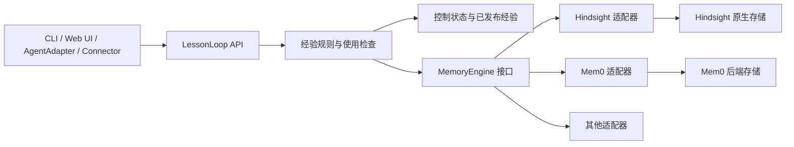

# 记忆引擎选型与可替换接入层

日期：2026-09-14。状态：选型结论与接口设计建议，尚未迁移或实现新接入层。

Windows 发行方案采用 `irm` 安装入口和预构建私有组件，统一部署核心、记忆引擎与运行依赖，详见[发布与本地运行方案](../../10-distribution-and-installation.md)。Hindsight 须通过默认发行配置的可行性验收，选型推荐不代表安装包已交付。

## 结论

LessonLoop 首选 Hindsight 自托管，保留自己的经验准入、适用性、用户纠正与来源撤回规则。Mem0 OSS 保留为现有原型和对照实现，Cognee 是最强备选。

这个判断基于产品需求、官方文档、发布记录和部分源码核查。Hindsight 尚未在本机完成运行验收，不宣称其在我们的任务上已经实测优于 Mem0。

建议同时抽象记忆接入层。业务接口描述材料、经验、纠正与使用意图；厂商适配器负责引擎的提取、检索和处理作业。这样可以保留 UI、CLI、代理插件与 Connector 的接口，在将来替换 Mem0、Hindsight 或其他产品。替换通常需要数据映射和重新处理，不能承诺改一个配置便无损切换。

## 需求与约束

用户在本次选型中明确了以下约束：

- 本地运行，数据服务自行部署，不购买付费记忆平台。
- 模型调用使用现有 GitHub Copilot 订阅，没有独立模型 API key；模型调用量目前不是主要取舍因素。
- 需要跨任务、跨项目积累经验，也需要接收外部材料并持续更新。
- 经验必须保留依据、适用条件和例外；用户可以纠正、停用或删除，变化应影响后续建议。
- 接入已有代理，日常自动学习和召回，用户不必逐条维护卡片。

这里的“本地”指记忆服务和存储本地运行。Copilot 推理仍通过其云端服务完成，会消耗现有订阅额度；不能把它描述成完全离线推理。嵌入与重排可采用本地模型，不额外购买 API 服务。

Mem0、Qdrant、TypeScript、只用一个数据库，以及具体的 L1–L5 字段、3 条/800 token 预算，是现有设计选择或参数。应按是否帮助产品目标评估，不能反过来用它们排除其他底座。当前需求依据见[产品定义](../../01-product.md)、[经验模型](../../02-experience-model.md)和[Connector 合同](../../08-connectors.md)。

## 横向比较

下表评价的是在上述约束下的契合度，不是通用性能排名。

| 方案 | 与 LessonLoop 相关的能力 | 主要代价与判断 |
|---|---|---|
| Hindsight 自托管 | 事实与经历提取；后台 observations 归纳；来源和原文证据；事实修订、派生重算；多路检索；独立 HTTP/MCP 服务 | 首选。可以复用较多经验学习机制；仍需领域规则、中文配置、纠正和删除验收 |
| Cognee 开源 | 文档和对话图谱；工具轨迹学习；session distillation；可定制 DataPoints、Tasks 与 Pipelines | 最强备选。已超出传统文档 GraphRAG；关系、向量、图及 session 的清理边界较多 |
| Mem0 OSS | 默认事实提取；存储与嵌入适配；语义候选、关键词与实体增强 | 能满足基础记忆。跨案例归纳、证据依赖和领域失效仍有较多工作由 LessonLoop 实现 |
| LangMem | 自定义经验 schema；提取、修改、删除建议；后台整合；可脱离 LangGraph Store 使用功能原语 | 适合作为可替换组件。自由度高，但完整产品需要自建更多存储与生命周期逻辑 |
| Graphiti | 时间化实体关系、事实有效区间、episode 来源、多跳与混合检索 | 适合历史关系成为核心的场景。我们当前更需要条件经验与持续归纳，暂不优先 |
| Letta | 有状态 Agent、可编辑与共享记忆、历史和归档管理 | 适合建设 Agent 运行时；接入已有代理的独立经验服务不需要整体换运行时 |
| MemOS 本地插件 | Trace → Policy → World Model → Skill；Policy 有触发、步骤、验证、边界与来源字段 | 方向很贴近。需区分本地插件、Python 服务与云产品；当前版本及删除传播边界使其暂居后位 |
| 自有领域层 + 事务型数据库 | 自由定义经验、来源、修订、作业与查询；所有产品规则可直接控制 | 后备架构。若引擎适配最终要求再维护一套完整学习系统，才值得承担全部自研成本 |

云端 Mem0 Platform、Zep 托管服务和云厂商记忆服务不进入当前付费方案候选。Mem0 Platform 的 Dream 已提供 synthesis、supersede、merge，不能说 Mem0 所有形态都没有归纳；这些能力不能直接算到我们正在使用的 OSS 包上。[S2]、[S7]

## Hindsight 胜出的关键点

### 免费开源版已有跨案例归纳

Hindsight 在 retain 之后，可以把相关基础事实整合成 observations，记录依据，并随新材料调整。observations_mission 能限定归纳方向，避免把所有对话细节都当作长期知识。[S4]

例如，几次调查发现“直接修改生成的客户端会被覆盖”，随后又遇到允许手工扩展的生成器。我们希望形成带边界的做法，并在发现例外时调整。Hindsight 已有基础事实、归纳和新证据更新的处理结构；Mem0 OSS 路线中，这部分主要由 LessonLoop 建设。

它并不保证归纳一定正确。一次事件不能自动证明普遍规律，引用数量也不等于来源独立性；这些仍由产品规则与任务评测约束。

### 归纳结果与证据关联

Observations 关联支持它的来源记忆与原文引用。基础事实被修订、停用或来源被删除后，引擎已有清理受影响 observations 和重新整合的机制。[S4]、[S5]

这直接支持“为什么形成这条经验”和“依据变了，哪些结论要重查”。Mem0 可以把来源放入 metadata，但我们还要自行维护跨经验的依赖和重算流程。

高层知识的失效范围仍需逐层核实：observations、mental models、缓存不能视为同一种对象。Hindsight v0.9.2 的发布记录包含根据引用来源撤回高层表述的修复；相关文档仍有删除不触发 staleness 的旧说明，修复也有边界。固定版本后，应实测最后一个来源删除、全部引用来源消失和重处理，不能把“数据库删除成功”当成“所有建议已清理”。[S6]

### 检索有多个独立候选入口

Hindsight 的语义、关键词、图和时间检索分别找候选，再融合重排。已核查的 Mem0 TypeScript OSS 3.1.8，则先取语义候选，BM25 和实体信号给这些候选加分，不能把仅由关键词找到的记录补进候选集。[S3]、[S8]

对代码标识符、具体工具名和分散在多条记录中的关联经验，前一种结构更值得采用。这里是机制上的优势推断，还没有本项目检索准确率的对比结果。

### 能使用现有 Copilot 登录

Hindsight 当前官方文档提供 github-copilot provider，通过官方 GitHub Copilot SDK 使用订阅，提取、整合和反思无需模型 API key。嵌入和重排独立配置，可以本地执行。[S9]

本轮还检查了固定 v0.9.2 的 pyproject.toml，其中包含 github-copilot-sdk 依赖；这支持接入能力已有发行版依据，但不等于本机认证与后台运行已经测试通过。[S10]

后续需要验证由运行后台服务的同一操作系统用户读取正常登录状态，以及提取调用不会触发宿主经验采集、把自身调用再次写入记忆。没有理由为此另购 Hindsight Cloud 或付费模型 API。Mem0 也可以通过我们自己编写的 Copilot SDK 适配接入订阅，这不是 Hindsight 独占能力；差别在于能否复用现有集成。

## 语雀文档与当前原型的核查结论

用户提供的[主流框架对比文档][S1]适合建立分类，但选型时需要区分产品形态和版本。

| 文档或常见说法 | 核查后的处理 |
|---|---|
| Mem0 更新即覆盖 | 当前 OSS 默认算法是 ADD-only，新旧事实可能共存；显式 update 与自动提取的行为应分开看 |
| Mem0 支持图记忆 | 当前 OSS 已移除外部 graph store；内置实体匹配不等于 Graphiti 的时间化关系图；Platform 另有图能力 |
| Mem0 92.5 / 94.4 分 | 官方仓库列为 Platform、Top 200 的特定评测结果；不能外推到本地 TypeScript OSS 与当前模型配置 |
| LangMem 强制绑定 LangGraph | Store 集成依赖对应接口，但功能原语允许自管存储，不必整体改用 LangGraph |
| Cognee 主要做文档图谱 | 当前已包含工具轨迹学习和经验蒸馏，应作为认真比较的备选 |

Hindsight 的推荐不依赖这些排行榜。模型、材料、检索深度和评分方法不同，不能用几个跨报告数字代替产品试验。[S2]、[S3]、[S11]、[S12]

当前仓库的 Mem0 原型提供了更具体的证据：

- 使用 mem0ai/oss 3.1.8。领域层整理经验后逐条 infer:false 写入，跳过默认提取、去重和首次实体链接；写入仍生成嵌入与词项字段，检索仍尝试 BM25 和实体增强。它不是纯向量 CRUD。[网关](../../../spikes/p0/mem0-gateway.ts)
- Mem0 的英文词项预处理在含英文或数字的混合文本中会丢掉中文。原型固定添加英文标签，本轮对安装包函数的隔离调用得到的词项只剩 conclusion、condition、topic、entiti。向量嵌入仍接收正文；该问题不能扩大成“中文完全无法召回”。现设计默认经验正文英文、原文证据保留原语言，因此还要单独测试中文问题检索英文经验。[检索文本构造](../../../spikes/p0/experience.ts)与[语言约定](../../04-contracts-and-extensions.md)
- 发布包顶层导入未使用的 SQL provider，原型使用 loader 适配；Qdrant 客户端固定在兼容版本。metadata-only update 实测仍产生嵌入调用。[P0 记录](../2026-09-13-p0/README.md)
- 既有存储报告通过 12 项小样本检查；本次调查期间类型检查和 23 项单测通过。真实模型任务对照没有运行，taskBenefitMeasured 为 false。[存储报告](../2026-09-13-p0/storage-probe.json)与[对照状态](../2026-09-13-p0/comparison.json)

3 条/约 800 token 来自现有架构和接口设计，限制的是最终自动回填的内容，不是库容量。原型实验传入 topK:3，但未执行 800 token 限额。两者都属于可调整预算，不能据此否决某个产品。

## 接入层可以怎样抽象

### 保留产品 API，在下方隔离引擎

现有 submitMaterial、getJob、recall、inspect、revise、remove、export 等接口已经在表达用户需求，可以继续作为稳定入口。[接口文档](../../04-contracts-and-extensions.md)

需要拆开当前 MemoryGateway 的三种职责：厂商引擎调用、LessonLoop 控制状态、数据库专用查询。Mem0 SDK、Hindsight SDK、Qdrant 过滤对象、bank ID 和各厂商 score 不应进入业务接口。




图中是职责划分，不要求增加多个数据库。控制表可以与引擎使用同一个 PostgreSQL 实例中的独立 schema，但不能依赖修改厂商内部表或假设跨 API 调用共享事务。物理部署方式在实现时决定。

### LessonLoop 持有稳定语义

| LessonLoop 持有 | 原因 |
|---|---|
| 用户身份、知识集合、授权与可信来源身份 | 不能让 bank/tag/filter 变化改变权限含义 |
| 来源 ID、来源修订、撤回和永久忘记记录 | 重处理、迁移或后台重试不能恢复已禁止的材料 |
| 用户纠正、停用及当前已发布经验的 ID/revision | Hindsight 重处理可能重置基础事实的人工修正；厂商 ID 变化不能丢失用户意图 |
| 已对外发布经验的规范化内容、条件、例外和可核对的依据映射 | 用户管理的是稳定经验；引擎重算可能拆分、合并或换 ID，需要重新准入 |
| 产品作业、纠正回执与厂商 operation 映射 | 已接收、可查询、归纳完成、已生效是不同状态 |
| 当次相关性、适用条件与例外检查 | 候选检索成功不能直接授予可采用资格 |

引擎继续管理原生基础事实、索引、向量、实体图和内部归纳。LessonLoop 不镜像所有内部记录，也不同时运行一套重复的默认提取流程。只有需要对外稳定使用或管理的经验进入规范化发布记录；引擎候选本身不直接变成 guidance。

每条发布记录绑定引擎实例、处理配置版本、原生产物版本或内容摘要，以及完整的已知依据关系。来源或原生产物被重算、拆分、合并或删除时，先暂停受影响发布记录，再重新准入并产生新修订。采用前按 ID 刷新绑定；引擎没有可靠变化通知时，需要定向读取核对或定期对账，核对失败则不继续使用缓存。无法判断用户停用意图应由哪些新产物继承时，保持暂停，不能仅因厂商换了 ID 就重新启用。

这种分工有实际代价：需要维护发布记录和原生结果的映射，并验证来源完整性。若某产品只能返回无来源的生成文本，就不能把它包装成满足完整合同的适配器。

### 合同需要表达处理阶段

下表是建议的内部合同，不是现有代码或第三方 API 名称。

| 操作 | 共同含义 | 必须保留的差异 |
|---|---|---|
| ingest | 提交有身份与修订的来源，或明确标记的经验草稿 | 自动提取/导入记录；幂等范围；一份材料可生成多条结果 |
| operation | 查询提交后的处理状态 | 已接收、已持久化、可查询、派生完成；部分失败与结果未知 |
| retrieve | 在授权范围内返回候选与来源引用 | 结果类型、证据完整度、实际生效的过滤、分数仅限本引擎解释 |
| inspect / list | 精确读取与完整分页 | 查询可见性、当前版本、完整性以及游标语义 |
| applyChange | 纠正内容、撤回来源或清理副本 | 原位编辑、来源重处理、派生重算；可逆停用与永久擦除分开 |
| export | 提供可迁移记录与清单 | 包含哪些来源、基础事实、归纳与用户编辑；不把局部结果称为全量 |
| consolidate / reflect | 显式请求后台归纳或综合推理 | 可选能力；原生支持、领域组件补齐、不支持应分别声明 |

写入返回 Promise 不代表已完成归纳。超时也不等于失败或取消。适配器需要返回可核对的 operation，或者明确标记 unknown，供核心阻止盲目重试。

以下 TypeScript 只说明最小形状，正式类型仍需在两个适配器验证后确定。业务 Experience 的完整字段沿用领域模型，不在研究文档复制。


```typescript
type ProcessingStage =
  | "accepted" | "durable" | "searchable" | "consolidated";

type OperationView = {
  operationId: string; // LessonLoop 稳定 ID
  state: "running" | "completed" | "partial" | "failed" | "unknown";
  reached: ProcessingStage[]; // 只列已核实阶段
  backendInstanceId: string; // 区分切换前后的实例
  reason?: string;
};

type SourceRef = {
  sourceId: string;
  sourceRevision: string;
};

type NativeRef = {
  backendInstanceId: string;
  nativeId: string;
  nativeVersion?: string;
};

type EvidenceRef = {
  source: SourceRef;
  locator?: string; // 摘录或事实在来源中的位置
  fact?: NativeRef;
  relation: "supports" | "contradicts" | "context";
};

type Candidate = {
  ref: NativeRef;
  profileVersion: string;
  contentDigest: string; // 适配器计算规范化结果摘要
  kind: "fact" | "episode" | "observation" | "summary";
  text: string;
  evidence: EvidenceRef[];
  provenance: {
    coverage: "complete" | "partial" | "unknown";
    revisionCheck: "verified" | "document_only" | "unverified";
  };
  // 此处不携带 guidance / applicable，资格由 LessonLoop 决定。
};

interface MemoryEngine {
  ingest(input: {
    operationId: string;
    scopeId: string; // 核心已完成认证与授权
    source: SourceRef;
    content: string;
    profileVersion: string;
  }): Promise<OperationView>;

  operation(operationId: string): Promise<OperationView>;

  retrieve(input: {
    query: string;
    scopeIds: string[];
    candidateBudget: number;
  }): Promise<{
    status: "complete" | "partial" | "unavailable";
    items: Candidate[];
  }>;

  inspect(ref: NativeRef): Promise<Candidate | null>;
}
```

检索 status 的 complete 只表示该次有限检索按声明能力执行完毕，不表示召回了库中全部相关知识。provenance.coverage 则单独说明产物依赖的来源集合是否完整；revisionCheck 只说明已返回来源的修订是否核对。几条真实引用不能证明已经返回全部依据，只有引用 ID 存在也不能证明它支持结论。无法确认完整依赖的归纳不直接取得自动采用资格。correction、list 和 export 等复杂输入在正式合同中继续定义；不为凑齐接口把它们压成一个无语义的 JSON blob。

### 用能力声明保留产品差异

仅有 supportsDelete:true 不够。应在“引擎版本 + 适配器版本 + 部署配置”的组合上声明实际保证：

| 能力 | 需要声明的范围 |
|---|---|
| 来源追溯 | 可核对到来源修订、仅到文档，或不完整；来源缺失时的行为 |
| 检索过滤 | 哪些字段在生成候选前生效；哪些是结果后筛；权限不得靠后筛降级 |
| 精确查询 | 指定 ID、实体、字段分别支持什么；是否完整，是否区分大小写 |
| 修改 | 可编辑基础事实、可编辑归纳，或只能重新处理来源 |
| 删除 | 基础记录、派生结果、缓存各自范围；何时可以验证清理完成 |
| 异步和重试 | operation 可查询性、幂等键保留范围；取消执行还是仅停止等待 |
| 归纳 | 原生支持、由领域组件补齐或不支持；产物的来源完整度 |
| 导出与恢复 | 来源材料、经验、用户意图、原生快照分别是否可迁移 |

安全与正确性要求是必需合同。可选能力缺失可以缩小功能，不能静默假装等价：权限不能“多取一些再过滤”，无法证明来源有效的归纳不能自动采用，清理未核实不能报告删除完成。

### 三类适配器的落点

| 适配器 | 建议路径 | 不能掩盖的限制 |
|---|---|---|
| Hindsight | 材料交给 retain；基础事实与 observations 作为候选；必要时 consolidate/reflect；由 LessonLoop 完成发布与使用检查 | observation 不能简单 PATCH；来源重处理会重置部分 curation；高层派生清理需版本验收 |
| Mem0 OSS | 现有领域提炼产生草稿，infer:false 入库；适配器封装基础检索和必要的后端查询 | 完整归纳需要领域组件补齐；不是同名 add/search 就获得与 Hindsight 相同效果 |
| Cognee | 原生 remember/recall、轨迹学习与蒸馏产物映射为候选，管线阶段映射为 operation | 来源删除、共享图关系和 session 清理的保证逐项验证，不借方法名推断 |

不要为了保持最小公共接口而禁用 Hindsight 的原生归纳，再在上层完整重写。统一输入、结果和控制语义；归纳策略可以由引擎原生提供，也可由领域组件补齐，并记录实际采用的模式。

## 模型接入与记忆接入分开

Copilot 是模型提供方式，Hindsight/Mem0 是记忆处理方式。应分别配置与测试。

- 模型侧统一结构化生成、取消语义、认证状态和使用量观测；本轮首选官方 Copilot SDK 登录路径。
- 嵌入与重排使用独立本地模型配置，不能假定 Copilot 订阅同时提供这两种 API。
- 记忆适配器优先复用厂商正式模型 provider。只有缺少对应接入时才建设局部 SDK 适配，不要求所有产品通过同一个伪装成 OpenAI 的 HTTP 代理。
- 主动提取、归纳调用使用与宿主工作会话隔离的运行环境，避免触发采集 hooks，形成自我摄入。

Hindsight 官方说明 Copilot provider 不应用部分温度与最大输出 token 设置。统一模型接口因此也需要报告有效配置，不能把请求参数存在当成实际生效。[S9]

## 迁移需要处理什么

替换接入代码与迁移知识是两项工作。可以迁移稳定经验、来源身份和用户意图，但不能保证新引擎生成相同的 embedding、图结构、内部 ID 或归纳文字。不同引擎的 score 也不能直接比较。

现设计在作业完成后默认 7 天清理材料，只长期保留短摘录。[保留规则](../../02-experience-model.md) 采用 Hindsight 时必须重新核对这条政策：LessonLoop 临时作业材料与引擎保存的 document、chunks、基础事实、引用是不同副本。清理作业材料不代表引擎原文也已清理；直接按 7 天删除引擎 document 又可能连带删除仍有价值的事实与归纳。必须验证是否能分别控制原文和派生数据的保留，或调整经用户允许的保留政策；不能默认 Hindsight 已满足“只长期保留短摘录”。

在获准可用的材料范围内，迁移有以下几种情况：

| 可用材料 | 迁移方式 | 不能承诺的内容 |
|---|---|---|
| 获准保留的原始材料，或仍可读取的原始来源 | 按来源与修订重新摄入，重建索引并重新评估派生结果 | 同一归纳文字、内部 ID 和相同排名 |
| 只有已发布经验与短摘录 | 以历史经验草稿导入，保留原依据边界，标记来源材料不足 | 原图、原始上下文与完整归纳过程重建 |
| 来源已经永久忘记 | 仅迁移必要的禁止重入与清理控制记录 | 从旧快照恢复被删除正文 |

不能为了将来可替换而自动延长材料保存期。若需要更强重建能力，应提供用户可配置的本地材料归档；这会改变保留策略，不能由迁移工具自行开启。

迁移清单应包含 schemaVersion、来源覆盖、已发布经验与修订、用户纠正/停用/忘记记录、后端版本、处理配置与模型标识、记录数量和校验值。秘密凭据不进入导出。

建议切换顺序：

1. 暂停新写入或建立明确的迁移检查点，排空旧作业；仍不确定的写入保持隔离。
2. 导出控制状态和获准迁移内容，先把停用/忘记规则加载到新适配器的调用路径。
3. 在新实例导入或重新摄入，建立稳定 ID 映射；清楚标记丢失的来源与能力。
4. 运行合同测试与真实经验回放。确认后切换路由，所有回调绑定 backendInstanceId，旧回调不能修改新实例。
5. 验证稳定后按保留政策处理旧库。回退时同样重放最新删除和纠正，不能直接启用旧快照。

首版支持维护窗口内替换即可，不必同时建设实时双写、跨引擎事务或自动灾备。引擎的内部多步骤处理仍可能异步，即便同用 PostgreSQL，也不应声称端到端 exactly-once。

## 实施与验收建议

先用两个适配器检验抽象：Mem0 保留现有行为，Hindsight 验证原生提取与归纳。Cognee 先记录能力映射，等出现实际替换需要再实现。

| 检查 | 验收重点 |
|---|---|
| 本地模型接入 | 现有 Copilot 登录，无独立模型 API key；提取、归纳和反思可运行；嵌入/重排本地执行 |
| 发行与运行 | 固定版本 irm 安装器管理 Hindsight、私有数据库及模型；普通 Windows 用户无需手工部署；健康、升级、回滚与卸载执行 I01–I14 |
| 经验形成 | 同一批真实材料保留结论、条件、例外与依据；无价值输入可不发布；归纳不补造事实 |
| 中英文与标识符 | 中文问句检索英文经验、同语言查询、代码参数精确查询分别测量；不只测英文小样本 |
| 纠正与重处理 | 用户停用后，来源更新、重新处理、重启和更换内部 ID 都不能使旧建议恢复资格 |
| 删除传播 | 一个来源支持多条事实与归纳、多来源支持同一归纳、最后一个来源删除、全部来源消失分别检查 |
| 数据保留 | 临时作业材料、引擎 document/chunks、基础事实及短摘录分别清点；到期清理不能暗中保留全文或误删有效经验 |
| 失败恢复 | 接收超时、任务部分完成、可查询但未归纳、旧实例迟到回调不能误报成功或重复发布 |
| 可替换性 | 同一外部 API 和规范化经验合同通过两个适配器；缺失能力明确报错或降级 |
| 导出与迁移 | 有原文、只有短摘录、存在永久忘记记录三种路径；完整分页、数量与校验值可核对 |

比较时固定真实材料、可用模型、使用规则和评价标准。先分别记录基础召回，再测完整任务收益；不能把“领域层有效”误当“某引擎必需”。模型调用量仍记录用于诊断和配额控制，但不作为当前首要淘汰指标。

本次交付只增加研究文档与阅读入口。现有原型继续使用 Mem0；Hindsight 的安装、登录调用、新适配器、存储迁移和真实模型验收均未执行。

## 来源与证据范围

以下资料在 2026-09-14 调查中读取。官方文档属于维护者能力说明；仓库发布版本和源码用于限定行为。上面的适配度与选型结论是据此作出的工程判断。未复制语雀全文，也未以论文分数声称已经完成本项目验证。

| 编号 | 来源 | 本文使用范围 |
|---|---|---|
| S1 | [语雀：Agent Memory 主流框架选型与对比][S1] | 记忆类型、失效语义与候选范围 |
| S2 | [Mem0 OSS 新算法迁移][S2] | ADD-only、graph store 变化、检索候选边界 |
| S3 | [Mem0 官方 benchmark 仓库][S3] | Platform/OSS、Top-K、模型配置与成绩不可直接外推 |
| S4 | [Hindsight Observations][S4] | 归纳、来源证据、整合范围和基础派生清理 |
| S5 | [Hindsight Memories API][S5] | 基础事实编辑/停用、observation 限制和重处理行为 |
| S6 | [Hindsight v0.9.2][S6]、[来源撤回修复][S6a]、[Mental Models API][S6b] | 高层归纳删除传播的版本差异及待验收边界 |
| S7 | [Mem0 Platform Dream][S7] | 区分托管归纳与 OSS，不把付费能力纳入本地方案 |
| S8 | [Hindsight Recall API][S8] | 多路召回、预算、来源输出与过滤语义 |
| S9 | [Hindsight Copilot provider][S9] | 订阅认证、无 API key、本地嵌入/重排及参数限制 |
| S10 | [Hindsight v0.9.2 依赖文件][S10]、[GitHub Copilot SDK][S10a] | 固定发行版依赖与官方 SDK 接入依据 |
| S11 | [LangMem 自定义提取][S11] | 可自管存储、schema 与修改建议 |
| S12 | [Cognee 工具轨迹学习][S12]、[Forget][S12a]、[v1.5.4][S12b] | 新学习能力与删除范围 |
| S13 | [Graphiti 官方仓库][S13]、[Letta 记忆说明][S13a] | 时间关系图与 Agent 运行时的适用边界 |
| S14 | [MemOS 本地插件][S14]、[Policy 类型][S14a]、[删除路径][S14b] | 与经验学习的契合点和生命周期待核查项 |
| S15 | [Hindsight 本地安装][S15]、[多语言配置][S15a]、[扩展接口][S15b]、[Reflect][S15c] | 自托管、模型、操作级扩展和结构化输出 |

[S1]: https://www.yuque.com/marion-luo/kfcqme/gbe6m1kremd2lo31?singleDoc
[S2]: https://docs.mem0.ai/migration/oss-v2-to-v3
[S3]: https://github.com/mem0ai/memory-benchmarks#results
[S4]: https://hindsight.vectorize.io/developer/observations
[S5]: https://hindsight.vectorize.io/developer/api/memories
[S6]: https://github.com/vectorize-io/hindsight/releases/tag/v0.9.2
[S6a]: https://github.com/vectorize-io/hindsight/pull/3618
[S6b]: https://hindsight.vectorize.io/developer/api/mental-models
[S7]: https://docs.mem0.ai/platform/features/dream
[S8]: https://hindsight.vectorize.io/developer/api/recall
[S9]: https://hindsight.vectorize.io/developer/models#github-copilot-setup
[S10]: https://github.com/vectorize-io/hindsight/blob/v0.9.2/hindsight-api-slim/pyproject.toml
[S10a]: https://github.com/github/copilot-sdk
[S11]: https://langchain-ai.github.io/langmem/guides/extract_semantic_memories/
[S12]: https://docs.cognee.ai/examples/agent-trace-lessons
[S12a]: https://docs.cognee.ai/core-concepts/main-operations/forget
[S12b]: https://github.com/topoteretes/cognee/releases/tag/v1.5.4
[S13]: https://github.com/getzep/graphiti
[S13a]: https://docs.letta.com/guides/agents/memory/
[S14]: https://github.com/MemTensor/MemOS/tree/main/apps/memos-local-plugin
[S14a]: https://github.com/MemTensor/MemOS/blob/main/apps/memos-local-plugin/core/types.ts
[S14b]: https://github.com/MemTensor/MemOS/blob/main/apps/memos-local-plugin/core/pipeline/memory-core.ts
[S15]: https://hindsight.vectorize.io/developer/installation
[S15a]: https://hindsight.vectorize.io/developer/multilingual
[S15b]: https://hindsight.vectorize.io/developer/extensions
[S15c]: https://hindsight.vectorize.io/developer/api/reflect
